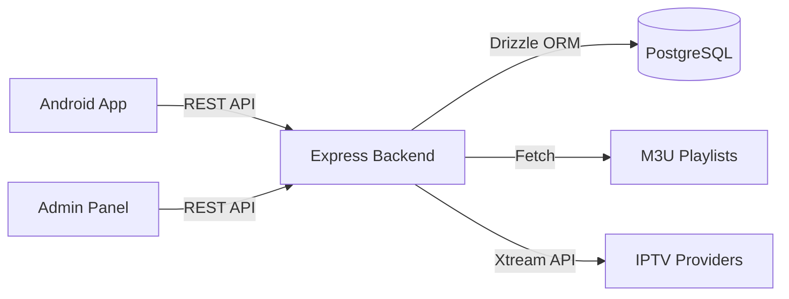

# EngTv — Final Architecture

## System Overview

EngTv is a live TV streaming application composed of three main components:



---

## 1. Backend API Server

| Layer | Technology | Details |
|-------|-----------|---------|
| Runtime | Node.js 22 | TypeScript 5.x |
| Framework | Express 4.x | with helmet, CORS, rate-limit |
| ORM | Drizzle | PostgreSQL via `node-postgres` |
| Auth | JWT | `jsonwebtoken` — 7d access, 30d refresh |
| Logging | pino | structured JSON, redacts secrets |
| Validation | Zod | on every request body/params/query |

### Directory Structure
```
artifacts/api-server/src/
  app.ts              — Express app setup (middleware chain)
  index.ts            — Server entry, graceful shutdown
  middlewares/
    auth.ts           — JWT verify/generate/refresh
    error-handler.ts  — Global error handler
    request-id.ts     — UUID per request
  routes/
    admin-auth.ts     — POST /admin/login, /admin/refresh
    channels.ts       — GET /channels, GET|POST|PATCH|DELETE /admin/channels
    categories.ts     — GET /categories, GET|POST|PATCH|DELETE /admin/categories
    sources.ts        — CRUD /admin/sources, sync, history, stats
    backup.ts         — GET /admin/backup, POST /admin/restore
    settings.ts       — GET /settings, PATCH /admin/settings
  lib/
    sync-engine.ts    — IPTV playlist parsing (M3U, Xtream), dedup, batch import
    health-checker.ts — Stream URL health verification (concurrent, configurable)
    crypto.ts         — AES-256-GCM encrypt/decrypt for source passwords
    scheduler.ts      — Periodic auto-sync (every 60s)
    serialize.ts      — Date → ISO string converter for Zod compatibility
    logger.ts         — pino instance with redaction
```

### API Endpoints

| Method | Path | Auth | Purpose |
|--------|------|------|---------|
| POST | `/api/admin/login` | — | Login, returns JWT + refresh_token |
| POST | `/api/admin/refresh` | — | Refresh expired access token |
| GET | `/api/settings` | — | Public settings |
| PATCH | `/api/admin/settings` | Admin | Update settings |
| GET | `/api/admin/stats` | Admin | Dashboard statistics |
| * | `/api/admin/*` | Admin | All admin CRUD operations |

### Environment Variables

| Variable | Required | Default | Purpose |
|----------|----------|---------|---------|
| `DATABASE_URL` | Yes | — | PostgreSQL connection string |
| `ADMIN_JWT_SECRET` | Yes | — | HMAC secret for JWT signing |
| `ADMIN_PASSWORD` | Yes | — | Admin login password |
| `PORT` | Yes | — | HTTP listen port |
| `NODE_ENV` | No | development | Controls error verbosity |
| `CORS_ORIGIN` | No | * | Allowed CORS origin (prod) |
| `LOG_LEVEL` | No | info | pino log level |
| `HEALTH_CHECK_CONCURRENCY` | No | 10 | Parallel health check workers |

---

## 2. Database Schema (PostgreSQL)

### Tables

#### `channels`
| Column | Type | Index | Notes |
|--------|------|-------|-------|
| id | SERIAL PK | — | — |
| name | TEXT | idx_channels_name | — |
| stream_url | TEXT | — | From IPTV source |
| logo_url | TEXT | — | — |
| category_id | INTEGER FK | idx_channels_category_id | → categories.id |
| source_id | INTEGER | idx_channels_source_id | → sources.id |
| external_id | TEXT | idx_channels_external_id | tvg-id from M3U |
| is_active | BOOLEAN | idx_channels_is_active | — |
| language | TEXT | idx_channels_language | 'ar'/'en'/'unknown' |
| country | TEXT | — | ISO code |
| is_healthy | BOOLEAN | — | null/true/false |
| sort_order | INTEGER | — | Display ordering |

#### `categories`
| Column | Type | Index | Notes |
|--------|------|-------|-------|
| id | SERIAL PK | — | — |
| name | TEXT | idx_categories_name | — |
| is_visible | BOOLEAN | idx_categories_is_visible | Public visibility |

#### `sources`
| Column | Type | Notes |
|--------|------|-------|
| id | SERIAL PK | — |
| type | TEXT | 'm3u' or 'xtream' |
| url/server_url | TEXT | Source URL |
| username/password | TEXT | Encrypted at rest |
| sync_interval_hours | INTEGER | Auto-sync schedule |
| retry_count | INTEGER | Failed sync attempts |

#### `sync_history`
Tracks every sync attempt with status, counts, and duration.

---

## 3. Android App Architecture

### Pattern: MVVM + Hilt DI + Room + Jetpack Compose

```
com.engtv/
  data/
    api/              — Retrofit + OkHttp (AuthInterceptor, EngTvApi)
    database/         — Room (entities, DAOs, AppDatabase)
    models/           — Data classes (Channel, Source, etc.)
    repository/       — ViewModel data sources (ChannelRepository, etc.)
    backup/           — BackupManager (JSON export/import)
  ui/
    home/             — Channel listing (Lazy grids, paging)
    player/           — ExoPlayer controls, quality/audio/subtitle selectors
    settings/         — Theme, language, player type preferences
    developer/        — Admin login, source management, sync controls
    theme/            — Material3 dark/light theme
  player/
    PlayerManager.kt  — ExoPlayer wrapper (singleton, track selection, DRM)
  core/
    crash/            — CrashReporter abstraction (NoOp → Firebase pluggable)
```

### Key Design Decisions

- **Authentication**: JWT stored in `EncryptedSharedPreferences`, restored on process death, expired check before requests, 401 auto-logout with mutex guard.
- **ExoPlayer**: Singleton via Hilt, track selection via `TrackSelectionOverride`, network recovery with exponential backoff (3 retries max), buffering timeout (15s).
- **Backup**: Excludes credentials by default (`includeCredentials=false`).
- **Crash Reporting**: `CrashReporter` interface with `NoOpCrashReporter` default; `FirebaseCrashReporter` ready for activation.
- **Paging 3**: Used for channel lists with Room `PagingSource`.
- **Theme**: Material3 dynamic theming, system/light/dark mode.

---

## 4. Frontend Admin Panel

- **Framework**: React 19 + TypeScript + Vite
- **Routing**: wouter (lightweight), lazy-loaded admin routes
- **State**: `@tanstack/react-query` for API data
- **UI**: shadcn/ui components, Tailwind CSS, dark-first
- **i18n**: react-i18next (Arabic primary)
- **Auth**: JWT stored in `localStorage`, Bearer header via custom fetch wrapper

### Admin Pages
- Dashboard — Stats cards (channels, sources, health)
- Channels — Table with search, bulk operations, health check
- Categories — Manage category visibility and ordering
- Sources — CRUD, sync triggers, scheduler status
- Backup — Export/restore all data
- Settings — App name, logo, colors

---

## 5. Security Model

| Concern | Implementation |
|---------|---------------|
| Transport | HTTPS enforced by deployment |
| Auth | JWT (7d) + Refresh Token (30d) |
| Password storage | `bcrypt` for admin password (via env) |
| Source passwords | AES-256-GCM encrypted at rest |
| API rate limit | 10 req/15min on login, 20 req/15min on refresh |
| Body size limit | 1MB on all requests |
| Input validation | Zod schemas on all endpoints |
| SQL injection | Prevented by Drizzle ORM parameterization |
| Error leakage | Production hides stack traces |
| Secrets | Never hardcoded — always env vars or encrypted |
| Android token | EncryptedSharedPreferences |
| Log redaction | pino redacts Authorization, Cookie headers |

---

## 6. Deployment

### Backend (Node.js)
```bash
# Build
pnpm --filter @workspace/api-server build

# Run (requires DATABASE_URL, ADMIN_JWT_SECRET, ADMIN_PASSWORD)
node artifacts/api-server/dist/index.js
```

### Frontend (Admin Panel)
```bash
pnpm --filter @workspace/engtv build
# Serve dist/public/ via nginx or CDN
```

### Android
```bash
cd android
./gradlew assembleRelease
# APK at: app/build/outputs/apk/release/
```

### CI/CD (GitHub Actions)
- `quality` — typecheck, tests, audit, build
- `build-backend` — compile + upload artifact
- `build-android` — lint + debug APK + release APK (with signing secrets)
- `release` — on `v*` tag: release notes, checksums, GitHub Release
